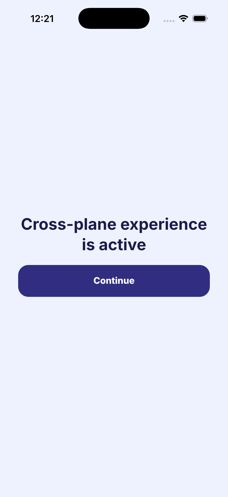
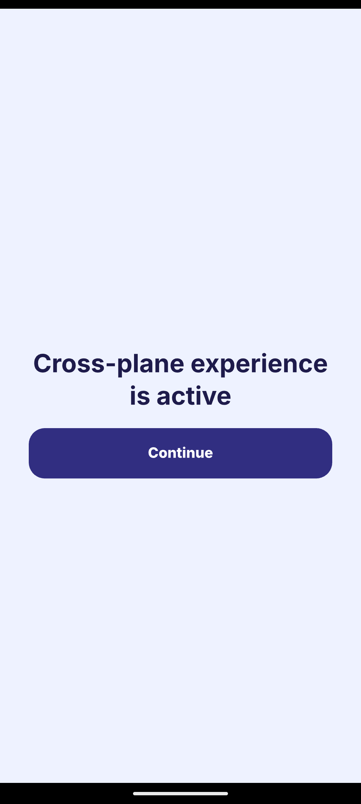

# Nuxie for Flutter

Deliver native Experiences. Let your Flutter app react to what happens.

Nuxie helps people discover, activate, and subscribe in your app through remotely
published Experiences. The Flutter SDK connects directly to Nuxie's iOS and Android
SDKs: the native engines run Journeys, present Experiences, handle purchases, and
maintain Feature access. Dart gives you a small, typed interface and reactive state.

**0.2 is a breaking redesign.** There are no compatibility aliases. This branch is a
source preview pending native release qualification; do not install the old `0.1.0`
artifacts for this interface. See [native setup](docs/native-setup.md) for building the
example against the matching SDK sources.

## Your first integration

Use Flutter 3.41+ / Dart 3.11+, iOS 15+, and Android API 23+. iOS uses Swift Package
Manager. Android uses the native SDK's Gradle dependency. For this source preview, run `python3 scripts/prepare-native.py` and add a path dependency
on `packages/nuxie_flutter` to your app. Follow the [native setup](docs/native-setup.md)
for your host. The Bloc and Riverpod adapters are optional.

```dart
import 'package:flutter/widgets.dart';
import 'package:nuxie_flutter/nuxie_flutter.dart';

Future<void> main() async {
  WidgetsFlutterBinding.ensureInitialized();
  final nuxie = Nuxie.instance;

  // Subscribe before configuration if you need startup activity.
  nuxie.activities.listen((activity) {
    // Forward activity.name and activity.properties to your analytics tool.
  });
  nuxie.appActions.listen((action) {
    // Route authored actions into your app using action.name and action.payload.
  });

  await nuxie.configure(const NuxieConfiguration(
    apiKeys: NuxieApiKeys(
      ios: String.fromEnvironment('NUXIE_IOS_API_KEY'),
      android: String.fromEnvironment('NUXIE_ANDROID_API_KEY'),
    ),
  ));

  runApp(MyApp(nuxie: nuxie));
}
```

`MyApp` is your own app. Pass the client into your widgets or state container as
`NuxieClient`; your app's tests can provide a fake. The singleton is available before
configuration so callback listeners never have to race native startup.

The API keys are your **public app keys**, one per platform. Never put a workspace
secret or server credential in a mobile app. Only the current platform's key is used.

## Three concepts to learn

| Concept | What your app does | What Nuxie does |
| --- | --- | --- |
| Events | `trigger('library_opened')` | Captures the event and evaluates authored Journeys. |
| Features | Observe `features`, query `hasFeature`, or consume usage | Maintains access and reconciles purchase evidence with server authority. |
| App Actions | Listen to `appActions` | Delivers named actions authored inside an Experience. |

You do not fetch a profile, select an Experience version, manage an event queue,
or render a Nuxie view inside a Flutter widget.

## Trigger an Experience

```dart
await nuxie.trigger('premium_library_requested', properties: {
  'source': 'library_tab',
});
```

In Nuxie, author a Journey whose entry condition matches this event and publish it
for the app/environment. Native code decides whether and when to present its
Experience. The example app's Events tab lets you try any authored event.

The Future means the native method was invoked. It does **not** mean an Experience
was shown, access was granted, the event reached the server, or the Journey finished.
Global activity is useful for observation; it is not a per-trigger result.

```dart
await nuxie.dismiss();
```

Dismissal respects native in-flight purchase work and the Journey's authored dismissal
behavior. It is safe to call when no Experience is visible.

## Make access reactive

```dart
NuxieFeatureBuilder(
  client: nuxie,
  featureId: 'premium_library',
  builder: (context, access, state) {
    if (state == FeatureState.unknown) {
      return const CircularProgressIndicator();
    }
    return access?.allowed == true
        ? const LibraryContent()
        : const UpgradeButton();
  },
)
```

The widgets in the builder are your own UI. For more control, use
`ValueListenableBuilder<NuxieFeatureSnapshot>` with `nuxie.features`.

- **unknown:** access has not been admitted for the current customer.
- **reconciling:** native access includes a verified-purchase projection awaiting reconciliation.
- **ready:** the native snapshot is reconciled. It does not imply an active network connection.

The snapshot is immutable and globally scoped. Unknown is not an access denial, and
an empty ready snapshot is valid. Logout invalidates the old customer's state.

For entity-scoped access, a particular threshold, or fresh server authority, query explicitly:

```dart
final access = await nuxie.hasFeature(
  'exports',
  requiredBalance: 1,
  policy: FeatureCheckPolicy.remote,
);
```

A remote failure is an error, not a synthesized denial. Global snapshot updates must
not be used as answers to entity-scoped queries.

## Consume metered Features

**Backend qualification is pending:** the current ingest rejects the native usage
command and entity-scoped queries. These interfaces are preserved from the native
SDKs, but are not production-qualified in this preview. Track the coordinated fix in
[UNIV-3135](https://universe.basis.dev/issue/UNIV-3135). The example reports the error;
it never invents a successful spend.

```dart
final result = await nuxie.useFeatureAndWait('exports', amount: 1);
if (result.success) {
  await exportDocument();
} else {
  showMessage(result.message ?? 'Export is unavailable.');
}
```

`success` means the usage command committed. Spending the final unit still succeeds;
do not reject that action because the returned remaining balance is now zero.
`authoritativeAccess`, `usage`, and `amountUsed` are preserved in the result.
Usage quantities must be positive whole units. Fractional or unsafe quantities fail before delivery.
Entity IDs restrict access to explicitly assigned grants.

Use `useFeature` when reporting usage without waiting for server confirmation. Call
one of these methods per action, not both. Native code owns durable commands and retry
identity. A disconnected channel or a Dart timeout does not cancel a committed command:
never automatically issue another usage command after an ambiguous failure.

For an explicit retry identity, persist an operation ID with the action and reuse it:

```dart
final receipt = await nuxie.consumeFeature(
  'exports',
  quantity: 1,
  operationId: persistedActionId,
  entityId: 'project-a',
);
if (receipt.accepted) {
  // The command committed, even when receipt.active is false after the last unit.
}
```

Cumulative `setUsage` reports only charge increases: 20 then 25 consumes 25 total;
a later report of 10 restores no credits.

Your host action and the usage command are separate operations. Server-side work still
needs your backend's own authorization and idempotency.

## Purchases work natively by default

No purchase controller is needed for Nuxie's built-in StoreKit / Play Billing handling.
Native Journeys retain product selection, offer context, transaction verification,
finishing, recovery, and Feature reconciliation.

A settings-screen restore is one call:

```dart
final result = await nuxie.restorePurchases();
// Inspect result.type: restored, noPurchases, or failed.
```

Already have a billing provider? Configure it once:

```dart
final configuration = NuxieConfiguration(
  apiKeys: const NuxieApiKeys(ios: 'ios_public_key', android: 'android_public_key'),
  billing: NuxieBilling.external(MyPurchaseController()),
);

class MyPurchaseController implements NuxiePurchaseController {
  @override
  Future<PurchaseResult> purchase(NuxieStoreProduct product) async {
    // Resolve the exact product and offer in your provider, then map its outcome.
    // Return purchased only after that provider confirms success.
    return const PurchaseResult.cancelled();
  }

  @override
  Future<RestoreResult> restorePurchases() async {
    // Call your provider and map restored / noPurchases / failed accurately.
    return const RestoreResult.noPurchases();
  }
}
```

This controller is an integration skeleton, not a working provider implementation.
Keep store IDs and platform offer context intact. Reject purchase contexts your provider
cannot honor instead of silently selecting another offer. `purchased`, `cancelled`,
`pending`, and `failed(message)` are distinct outcomes. Request IDs and native callback
completion stay inside the SDK.

External success is the provider's declaration; it does not invent store evidence or
immediately grant Features. Native Feature state remains the access source of truth.
Advanced native integrations can select `NuxieBilling.native(handling:
PurchaseHandlingMode.observer)` when the host owns transaction finishing. This is
separate from external billing ownership.

## Identity, locale, and lifecycle

```dart
await nuxie.identify('customer_123', userProperties: {'plan': 'free'});
await nuxie.setLocaleIdentifier('en-GB');
await nuxie.reset(); // Logout; rotates the anonymous ID by default.
```

Configuration is immutable while running. Concurrent identical configuration calls
share setup; a different configuration fails rather than partially reconfiguring
billing. `shutdown()` is available for explicit teardown; normal applications let the
native SDK manage their lifecycle.

Cancel subscriptions when their owner is disposed. App Actions and activities are
live, non-replaying streams. Attach navigation handlers to a router that can accept or
queue an action before its navigator is mounted.

## Run the SDK Lab

The [example app](packages/nuxie_flutter/example) runs on both iOS and Android. It has
three screens, an automated validation action, and displays command results alongside real native callbacks:

- **Connect:** configure, inspect versions/identity, identify/reset, locale, restore, shutdown.
- **Features:** observe readiness and balances, query cache/server access, consume usage.
- **Events:** trigger authored Journeys, dismiss native presentation, inspect activities and App Actions.

```sh
cd packages/nuxie_flutter/example
flutter pub get
flutter run -d <device-id> \
  --dart-define=NUXIE_IOS_API_KEY=<public-key> \
  --dart-define=NUXIE_ANDROID_API_KEY=<public-key> \
  --dart-define=NUXIE_EVENT=premium_library_requested \
  --dart-define=NUXIE_FEATURE=exports
```

The same published Experience, presented natively from the Lab on iOS and Android:

<p>
  
  
</p>

You can also enter public keys and event/Feature names in the app. The Lab selects the
development environment. That environment normally uses Nuxie's hosted development
ingest; an attended local-backend validation uses native test-host configuration,
not a production Dart endpoint override.

## More detail

[API reference](docs/api-reference.md) · [Native setup](docs/native-setup.md) ·
[Bloc and Riverpod](docs/adapters.md) · [Testing](docs/testing.md) ·
[Architecture](docs/architecture.md) · [Troubleshooting](docs/troubleshooting.md)
